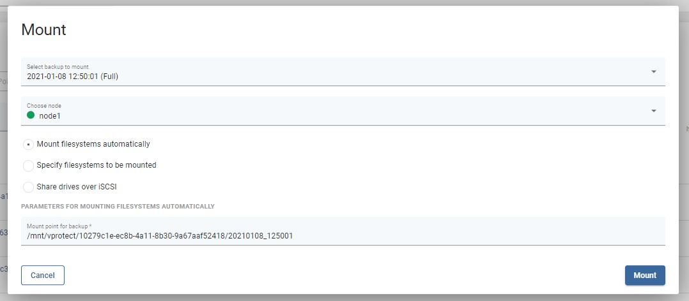
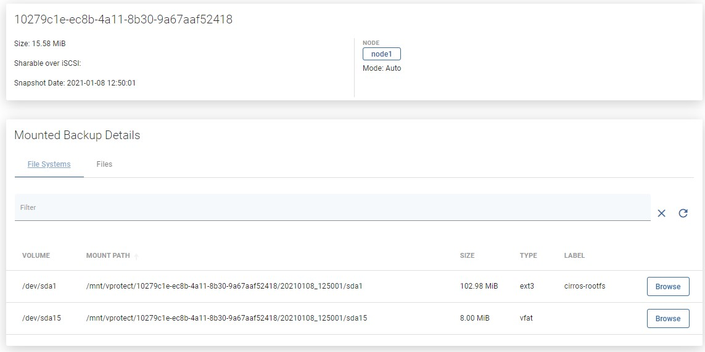

# File-level Restore \(Mounted Backup\)

To mount backup go to the Instances tab under the Storage Providers section on the left side menu, then click on the mount icon next to a chosen storage instance 

On the popup window, you can select which backup you want to mount and on which node.

Mounted Backups tab show mounted storage-instance backup's on vProtect node.

* `Storage` - mounted instance name
* `MODE` - Auto - vProtect auto-detect filesystems and mount it on path "/mnt/vprotect/". In Manual mode user chose mount point for selected filesystems.
* `NODE` - vProtect node responsible for mount job.
* `SNAPSHOT DATE` - date informing when the backup was created.
* `FILE SYSTEMS` - number of mounted filesystems.
* `FILES` - number of mounted virtual disk images.

Next to every mounted backup you can see three buttons:  
To unmount backup click on   
To remount backup click on   
To go to the details page of mounted backup click on 

On the details page, you can view some basic information or go deeper and browse files.

With a web browser, you can obtain even a single file from your storage instance backup.

