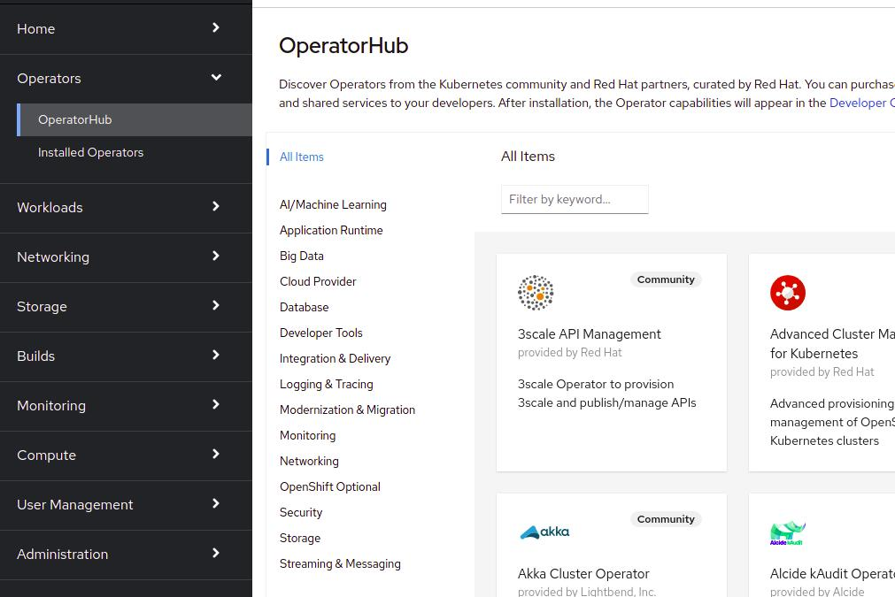
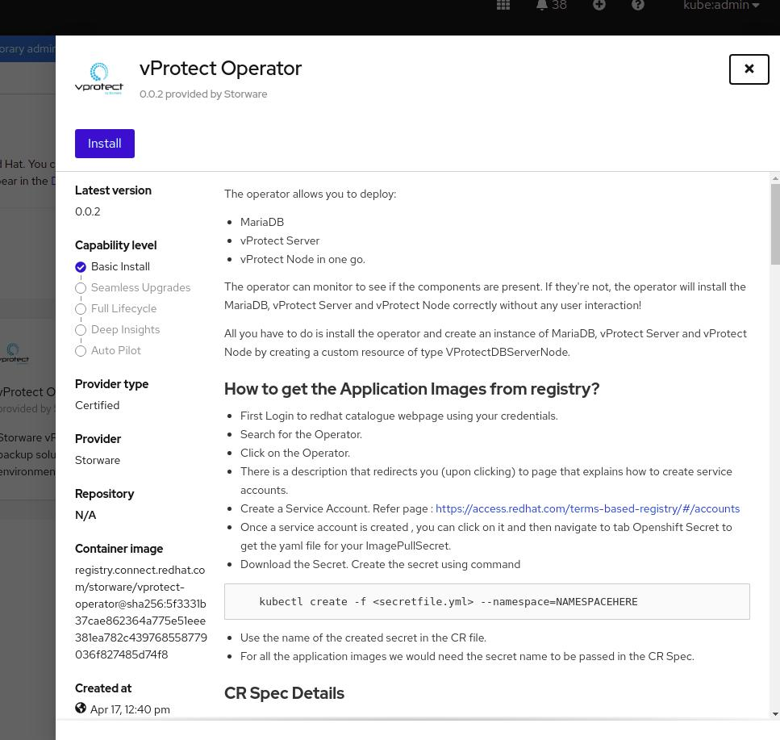
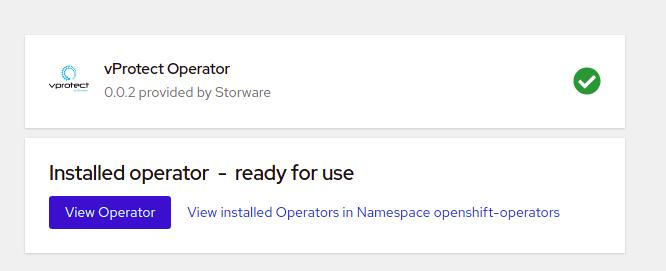
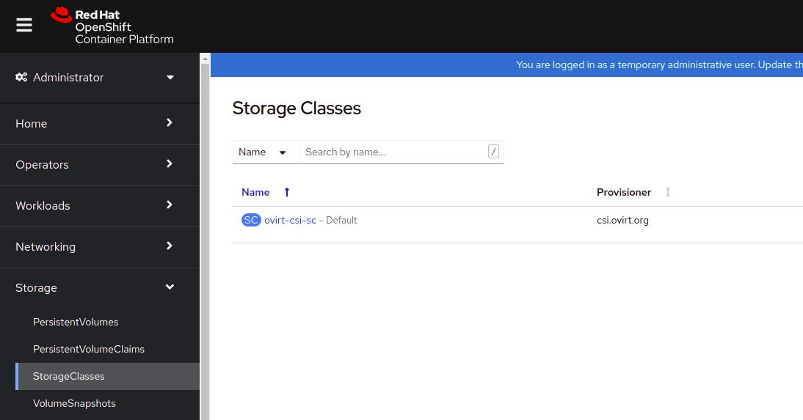
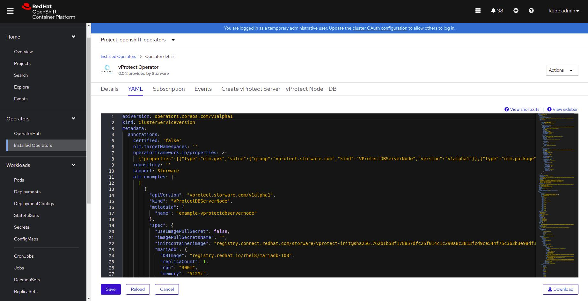
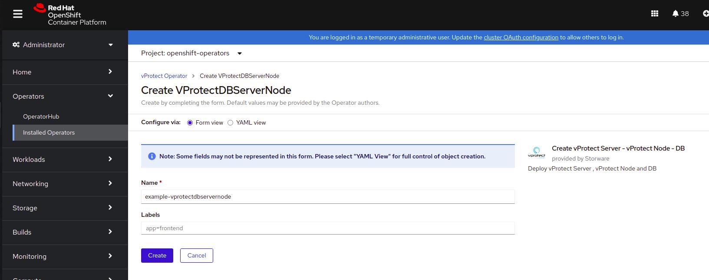
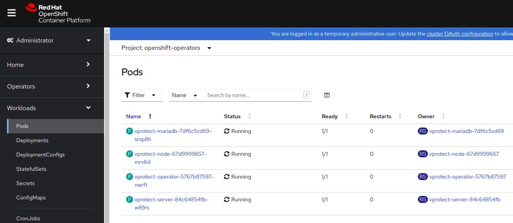
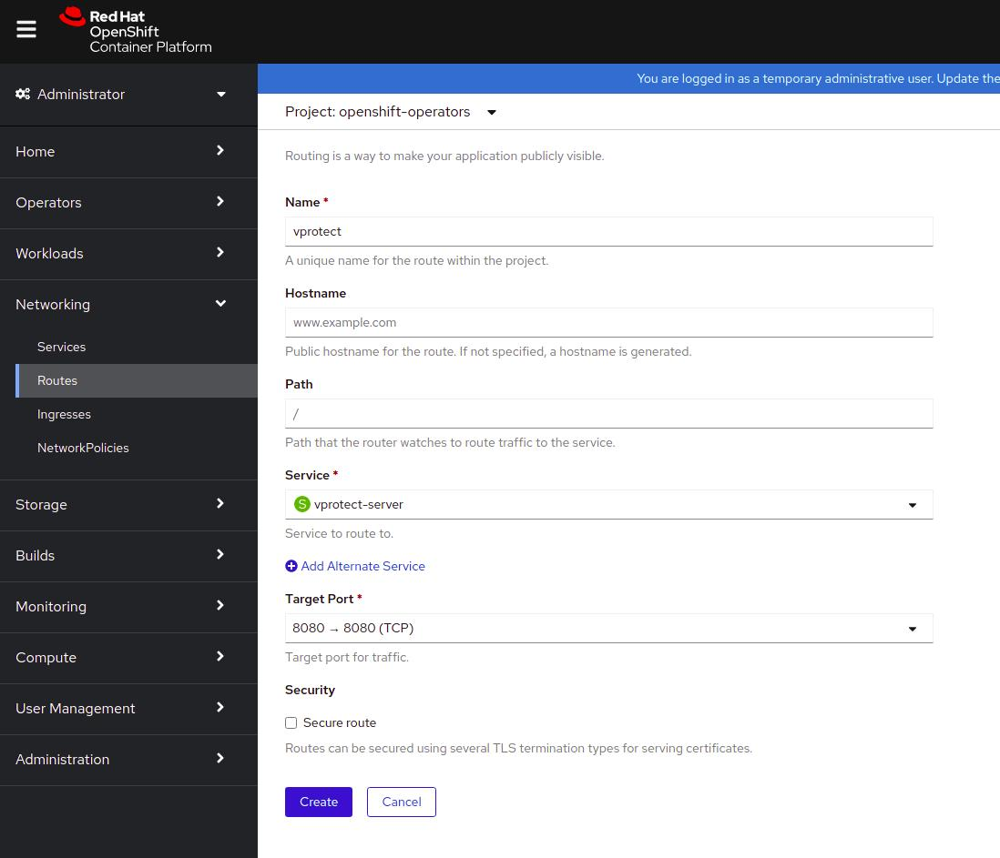
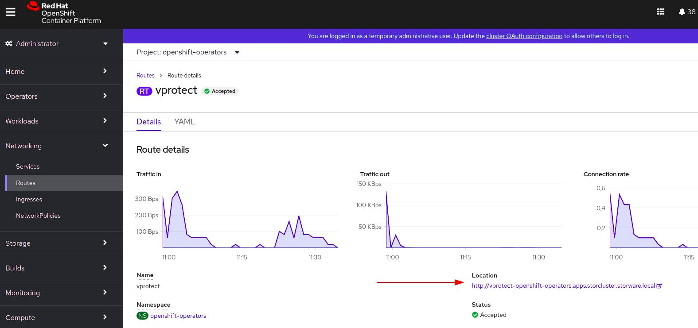

# Installing vProtect Operator in OpenShift

vProtect Operator will be installed from OperatorHub available in Openshift GUI




Type "vprotect" in search field


Choose operator without "marketplace" label and click **Install** button




Operator will be successfully installed




Go to Storage -> StorageClasses tab and check available storage classes. In this case it is **ovirt-csi-sc**




Choose vProtect operator from list of installed operators and go to **YAML** tab




We need to edit below fields in yaml with values from storage classes and valid vprotect server url

```
"storageClassName": " ovirt-csi-sc ",
"storageClass": "ovirt-csi-sc"
"stagingStorageClass": "ovirt-csi-sc"
"server": {
           ...
           "image": "registry.connect.redhat.com/storware/vprotect-server",
           ...
           },
           spec:
             containers:
             ...
                - name: RELATED_IMAGE_SERVER
                  value: >- registry.connect.redhat.com/storware/vprotect-server
               ...
```


Example valid *[yaml file](https://storware-my.sharepoint.com/:u:/g/personal/a_spinek_storware_eu/ESap14S4R4xMvRr6HM44EjYB8eO3VWhog9WnD9gOiUESUg?e=qLYbDj)*


After changes click Save.

Go to **Create vProtect Server - vProtect Node - DB** tab and click **Create vProtectDBServerNode** button.


Provide your deployment name and click **Create** button




You can check progress in Workloads -> Pods tab. After installation every pod should be in running state.




Go to Networking -> Routes tab and click **Create Route** button.


Provide whatever url you want vProtect to be accessible from. Choose **vprotect-server** as a **Service** and **8080 -> 8080** or **8181 -> 8181** as a **Target Port**




To check effective URL to vProtect press newly created route and read **Location** field


