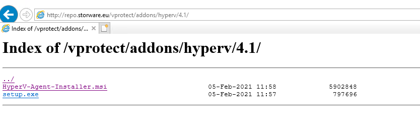
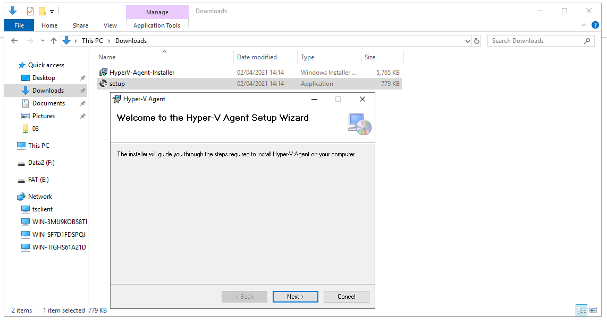
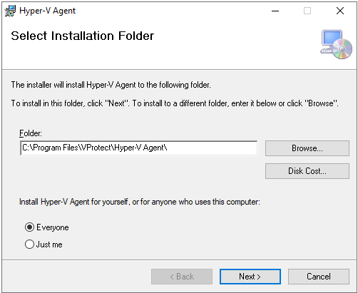
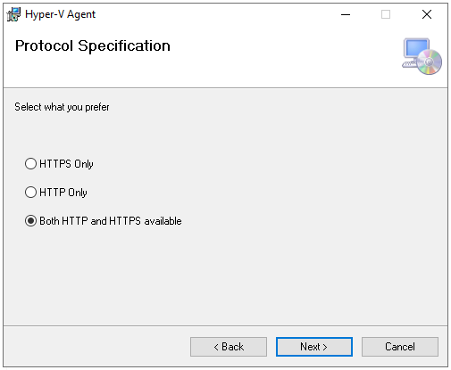
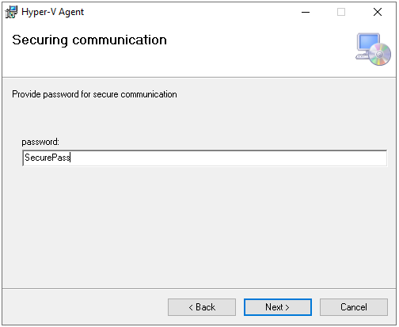

# Microsoft Hyper-V

## General

Microsoft Hyper-v is the only hypervisor that requires the installation of an agent. The process is very simple, the rest of the configuration is similar to other suppliers. With RCT \(also known as CBT in other virtualization platforms\) both full and incremental backups are supported for this hypervisor

**Note:** Installation requires .NET Framework 4.7.2 or higher  
**Note:** vProtect supports backup for Hyper-V 2016 and newer versions \(also non-GUI versions\)  
**Note:** Hyper-V 2016 does not support the disk exclusion feature during export operation \(because of WMI Framework version 14393\). Therefore, the disk of the virtual machine will be cloned to the export directory and deleted later in the execution.

To add a Hyper-V hypervisor host to vProtect, use a URL similar to the following:

```text
http://10.40.1.146
or
https://10.40.1.146
```

**Note:** Instead of using accounts for authentication, in the case of Hyper-V we only use the password provided during the agent installation. So for the username in the vProtect dashboard, you can use even a non-existent name.

## Example

How to start backup for Hyper-V platform:

* From our repository [http://repo.storware.eu/vprotect/addons/hyperv/](http://repo.storware.eu/vprotect/addons/hyperv/) download:
  * **HyperV-Agent-Installer.msi**
  * **setup.exe**.



* Put installation files to Hyper-v host.
* Run installation from **setup.exe** file. 
* Click **Next** to proceed with the installation.



* Type path to install Hyper-V Agent. And accept it by click **Next**.



* Chose Protocol to communicate between agent and vProtect node. And accept it by click **Next**.



* Provide a password for secure communication \(you will need it to add Hyper-V to vProtect\). And accept it by click **Next**.



* Click **Next** to start installation.
* If Windows UAC prompts you about installation, accept it by choosing **Yes**.
* Click **Finish** to end installation.
* Go to vProtect WebUI &gt; Virtual Environments &gt; Infrastructure &gt; Hypervisors click on button +Add Hypervisor.
* In the "Add New Hypervisor" window fill all fields:
  * Host address in URL form \(eg. http://10.40.1.150\)
  * username - we don't use this parameter at the moment, you can type anything.
  * password - use the same what you set in the installation agent process.
  * Number of disk export threads - parameter that can help with data transfer speed. _We recommend starting backups with the default value of 2 and making any changes based on the observation of the environment._ 


* Click **Save** to finish adding your Hyper-v host. Repeat all steps for all Hyper-v hosts.

