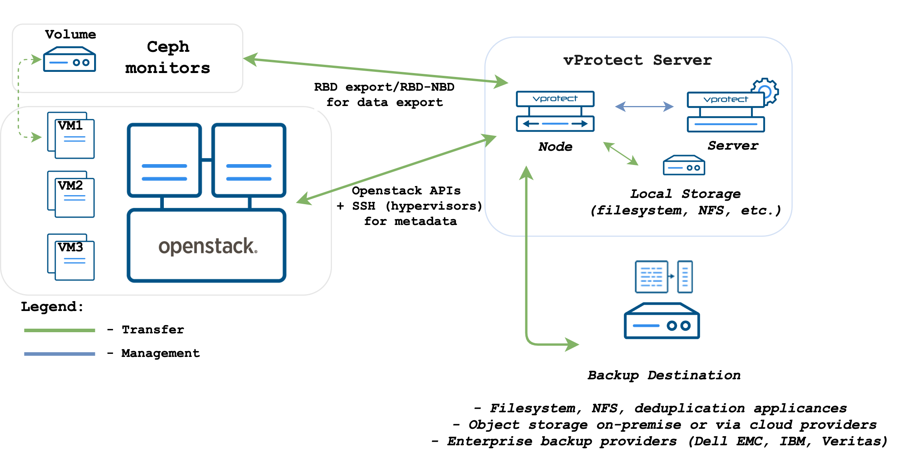
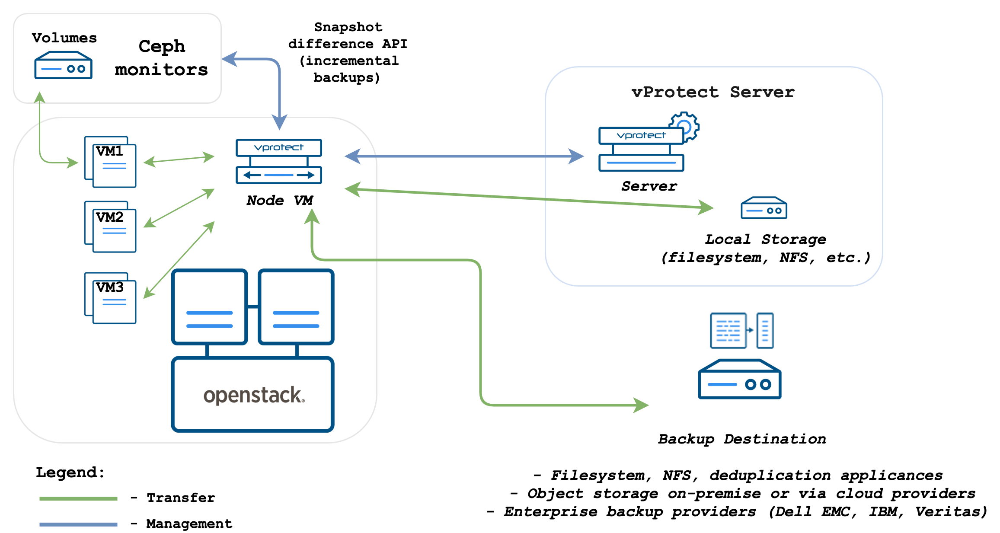

# OpenStack

vProtect supports backup for OpenStack:

* Disk image transfer - for KVM hypervisors with VMs using QCOW2
* Volumes or Ceph-based storage:
  * supports incremental backup
  * disk images are transferred directly from API \(no Proxy VM required\)
* Disk attachment through Cinder:
  * supports all hypervisors and storages
  * no incremental backup
  * proxy VM is required - used for disk attachment process.

## Backup Strategies

### Libvirt strategy

vProtect supports OpenStack environments that use KVM hypervisors and VMs running on QCOW2 or RAW files. vProtect communicates with OpenStack APIs such as Nova and Glance to collect metadata and for import of the restored process. However, the actual backup is done over SSH directly from the hypervisor. Process is exactly the same as in [Deployment in KVM/Xen environment](kvm-xen.md). vProtect Node can be installed anywhere - it just needs to reach OpenStack APIs and hypervisors SSH via network. Both full and incremental backups are supported.


### Disk attachment

vProtect supports also disk-attachment method using cinder. This should allow you to use cinder-compatible storage and still allow vProtect to create backups. Currently only full backup is supported. vProtect needs to communicate OpenStack service's API to attach drives to the proxy VM with the vProtect Node installed.


### Ceph RBD storage backend

vProtect supports also deployments with Ceph RBD as a storage backend. vProtect communicates directly with Ceph monitors using RBD export/RBD-NBD when used with Libvirt strategy or - when used with Disk-attachment method - only during incremental backups (snapshot difference).

#### Libvirt straegy



#### Disk attachment strategy


vProtect supports OpenStack with Ceph RBD volumes. Here is an example of a typical \(expected\) section that needs to be added in `cinder.conf` for Ceph in the OpenStack environment:

```text
[rbd]
volume_backend_name = rbd
volume_driver = cinder.volume.drivers.rbd.RBDDriver
rbd_pool = volumes
rbd_ceph_conf = /etc/ceph/ceph.conf
rbd_flatten_volume_from_snapshot = false
rbd_max_clone_depth = 5
rbd_store_chunk_size = 4
rados_connect_timeout = -1
glance_api_version = 2
rbd_user = volumes
rbd_secret_uuid = ce6d1549-4d63-476b-afb6-88f0b196414f
```

A good article on how to set up Ceph with OpenStack you can find [here](https://superuser.openstack.org/articles/ceph-as-storage-for-openstack/).

vProtect Node supports Ceph RBD and for that, you will need to install ceph libraries:

1. On **vProtect Node** enable required repositories:

1.1 For vProtect node installed on RHEL7:

```text
   sudo subscription-manager repo --enable=rhel-7-server-rhceph-4-tools-rpms
```

1.2 For vProtect node installed on RHEL8:

```text
   sudo subscription-manager repo --enable=rhceph-4-tools-for-rhel-8-x86_64-rpms
```

1.3 For vProtect node installed on CentOS7:


sudo yum install epel-release  
sudo rpm --import '[https://download.ceph.com/keys/release.asc](https://download.ceph.com/keys/release.asc)'  
sudo yum install [https://download.ceph.com/rpm-octopus/el7/noarch/ceph-release-1-1.el7.noarch.rpm](https://download.ceph.com/rpm-octopus/el7/noarch/ceph-release-1-1.el7.noarch.rpm)


1.4 For vProtect node installed on CentOS8:


sudo yum install epel-release  
sudo rpm --import '[https://download.ceph.com/keys/release.asc](https://download.ceph.com/keys/release.asc)'  
sudo yum install [https://download.ceph.com/rpm-octopus/el8/noarch/ceph-release-1-1.el8.noarch.rpm](https://download.ceph.com/rpm-octopus/el8/noarch/ceph-release-1-1.el8.noarch.rpm)


1. Install `rbd-nbd` and `ceph-common` package, with all dependencies:

   ```text
   yum install rbd-nbd ceph-common
   ```

2. Add hypervisor manager as described [here](openstack.md) and while you add them:
3. switch `Enable Ceph` toggle to on
4. provide `Ceph keyring file contents` which is contents of your keyring file from Cinder host - `/etc/ceph/ceph.client.admin.keyring`, example:

```text
     [client.admin]
     key = AQCCQG5dGKhUFBAA9G7TTQWfFXbF1ywbqpA1Vw==
     caps mds = "allow *"
     caps mgr = "allow *"
     caps mon = "allow *"
     caps osd = "allow *"
```

* provide `Ceph configuration file contents` , example:

```text
     [global]
     cluster network = 10.40.0.0/16
     fsid = cc3a4e9f-d2ca-4fec-805d-2c40605723b3
     mon host = ceph-mon.domain.local
     mon initial members = ceph-00
     osd pool default crush rule = -1
     public network = 10.40.0.0/16
     [client.images]
     keyring = /etc/ceph/ceph.client.images.keyring
     [client.volumes]
     keyring = /etc/ceph/ceph.client.volumes.keyring
     [client.nova]
     keyring = /etc/ceph/ceph.client.nova.keyring
```

* Now you can save and sync inventory - if Ceph communication works properly you should be able to see Hypervisor Storage entries \(in Hypervisors -&gt; Storage tab\) representing your Ceph storage pools.

## QCOW2 files on NFS storage

**Example:** scenario QCOW2 files residing on NFS

You can configure the NFS volume backend here:

[https://docs.openstack.org/cinder/rocky/admin/blockstorage-nfs-backend.html](https://docs.openstack.org/cinder/rocky/admin/blockstorage-nfs-backend.html)

Make sure QCOW2 volumes are enabled.

For an NFS backend, it's recommended set these values in `/etc/cinder/cinder.conf`:

`default_volume_type=nfs    
nfs_sparsed_volumes = true    
nfs_qcow2_volumes = true    
volume_driver = cinder.volume.drivers.nfs.NfsDriver    
enabled_backends = nfs`

## Adding hypervisor managers

When creating the hypervisor manager, provide the following data in fields:

URL - Keystone API URL, e.g. `http://10.201.32.40:5000/v3`

Username - OpenStack user

Password - password for that user.

When you index the hypervisor manager, **make sure to provide correct SSH credentials** for each hypervisor that appeared in the Hypervisors tab. You can also use [SSH public key authentication](../../common-tasks/ssh-public-key-authentication.md).

**Note: When restoring the instances, make sure that the provided user is a member of the target tenant.**

## Limitations

* vProtect does not backup and restore keypairs that were created by other OpenStack users than the one used in vProtect. Restored instance will have no keypairs assigned. In such a case, the keypairs have to be backed up and restored manually under the same name before restoring the instance.
* For libvirt strategy only QCOW2/RAW files or Ceph RBD are supported as the backend
* Disk attachment method with Ceph requires access to the monitors from the Proxy VM.