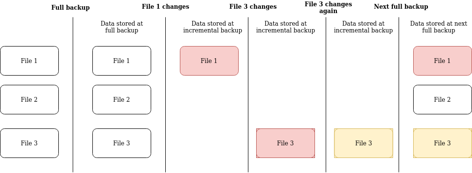
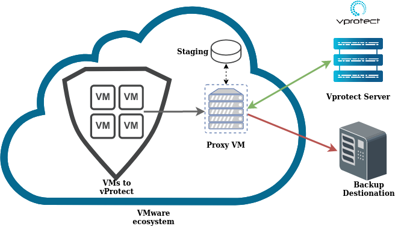
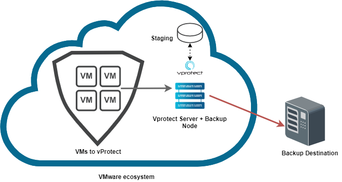
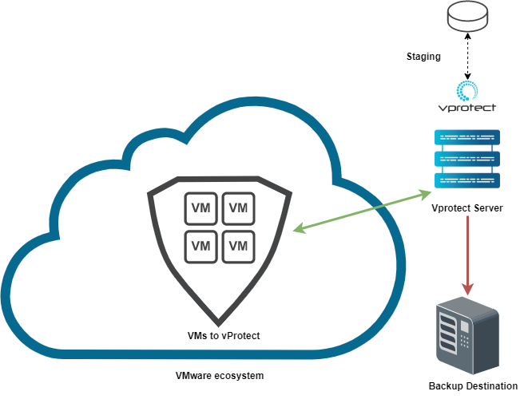

# VMware vSphere/ESXi

vProtect supports agent-less data protection for VMware vSphere and ESXi environments. Both full and incremental backups are supported.

**Note:**

* vProtect node must be installed on CentOS/RHEL 7.x to backup VMware virtual machines

## Backup process

### Full Backup

Full backup contains entire virtual machine data (and metadata) each time backup action is executed. It is available for every supported by VMware guest operating system. At the same time It is the most time and resource consuming type of backup.

### Incremental Backup

Incremental backups consume less space and resources than full backups because they include only the pieces of data that have changed since the last backup. Consider following scenario, where we want to protect 3 files:

First request for incremental backup will always result in full backup (all data is considered as new), so all three files are backed up. At some point in time **File1** changes while **File2** and **File3** remain untouched. 

At the next execution of backup schedule only **File1** will be backed up as it's the only one that changed. Afterwards only **File3** changes it's contents so this portion of data will be backed at the next scheduled backup. Again, **File3** changes for the second time, which means subsequent incremental backup will contain **File3** only. Finally the data taken at the next **full** backup will contain **third** version of **File2**, **second** version of **File1** and (original, unchanged) version of **FIle1**.

The very important thing to notice here is the usage of Change Block Tracking technology, which dramatically increases performance and reduces time of backup as it sends only those pieces of information that changed on a block level. You can refer to [VMware KB](https://kb.vmware.com/s/article/1020128) to get more detailed 
description of how **CBT** works

Now, when we know of how we can backup our data it is time to explain how we can transport data to our backup destination, which brings us to

**Note:**

* in order to execute incremental backups you need to have at least one schedule with inremental backup selected and only then you have to execute full backup - this will result in CBT change set IDs recorded, which is needed for the next incremental backup

## Transport types

There are 2 transport modes supported by vProtect:

* Hot-Add
* Network Block Device (NBD)

Transport modes are detected and selected automatically depending on the deployment configuration.

### Hot-Add

This is the default transport mode if you choose to deploy a **Proxy VM** (vProtect Node in a VM) inside your VMware cluster. During the backup a cloned VM is created from the backup snapshot, then these disks are hot-added to our **Proxy VM** and transferred to backup destination. This approach eliminates data transfer over LAN during backup and restore.

Here is example where vProtect Server is installed anywhere in your infrastructure (accessible to the nodes) and node is installed inside a VM in VMware environment:

Server and node can also be installed together:

### Network Block Device (NBD)

This transport mode is used when **Hot-Add** is not available for some reason (i.e. you decided to deploy Node outside of VMware environment). NBD is a Linux style kernel module which handles remote storage as a block device and passes it over TCP/IP connection.
In this example vProtect Server and Node is deployed outside of VMware environment:

**Note:**

* this transport, although simpler to setup, is not as efficient as previous method because in this case NBD transport is going to be used so data will travel using LAN.

## Adding hypervisor manager

1. Backup user must have the following privileges for backup/restore procedure:
   * VirtualMachine &gt; Change Configuration
   * VirtualMachine &gt; Edit Inventory
   * VirtualMachine &gt; Provisioning
   * VirtualMachine &gt; Snapshot management
   * Datastore &gt; Browse datastore
   * Datastore &gt; Update virtual machine files
   * Datastore &gt; Update virtual machine metadata
   * Resource &gt; Assign virtual machine to the resource pool
   * Tasks &gt; Create task
2. You must have open ports 443/TCP 902/TCP from ESX/vCenter to vProtect node to run backup.
3. Add your vCenter as Hypervisor Manager in Web UI - `https://vcenter.hostname.or.ip`

If you have stand-alone ESXi hosts - add all hypervisors separately in the Hypervisors tab - provide just their hostnames or IPs and credentials.

